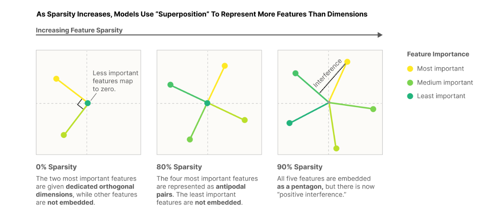
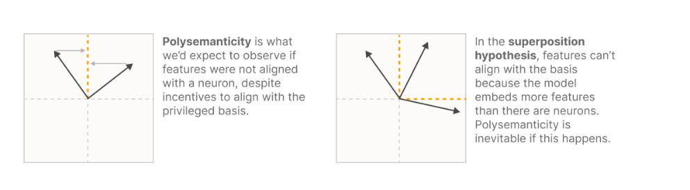
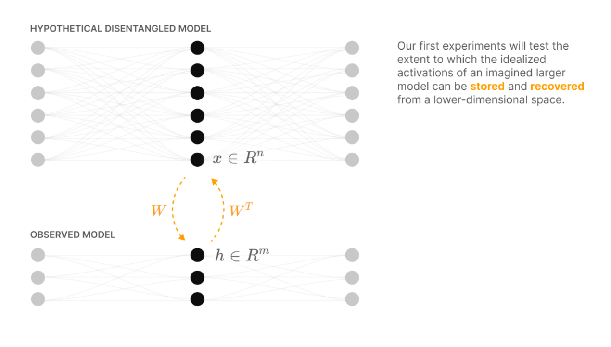
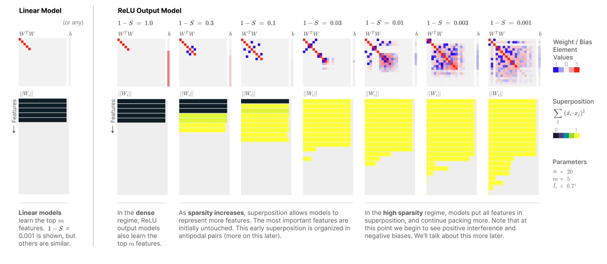
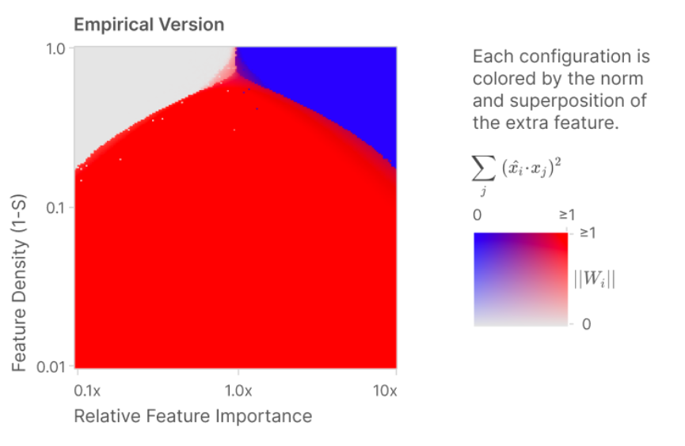
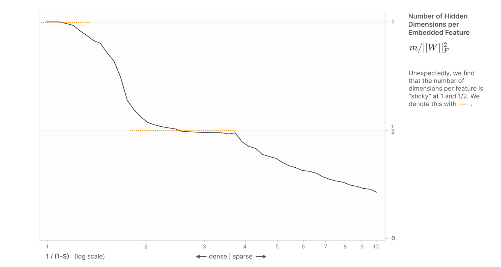
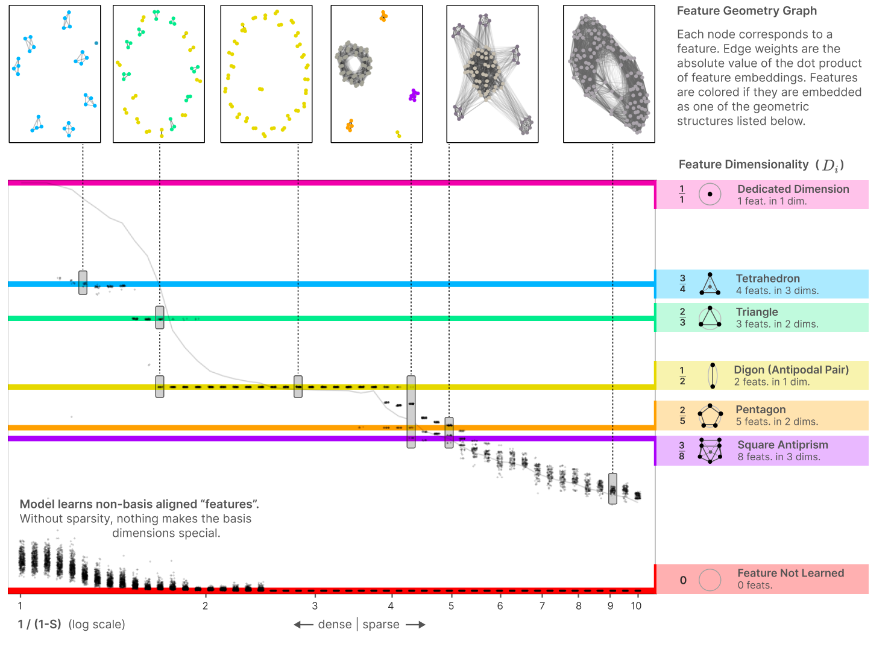

# notes for superposition of features in activations

## toy models of superposition paper notes
https://transformer-circuits.pub/2025/attribution-graphs/biology.html

see my implementation at the code/superposition folder in this repo

a feature is a concept represented as directions in activation space. (a concept the group that includes common properties that objects in the world share. like a dog is a concept, the color red is a concept. ).   

models can represent more features than dimensions. this is called superposition. each coordinate is outputed by a neuron. so each neuron represents more than one feature.  

using a example. input (1,5) random floats. with a sparsity mask of percenage of masking to 0. model: encoder (5,2) decoder (2,5). weight tied same weights. then relu to outputs (no relu in between). we graph the 5 encoder rows.  
as seen in the graph, at 90% sparsity when all 5 features are represented, the activation form basis that are not purely orthogonal.   

encoder neurons population code the input from input space to latent space, each contributing one coordinate. and each decoder neuron use that latent activation to predict one coordinate of output space. 

some terms  
decomposability: network representations can be broken into independent features which don't interfere with each other    

linearity: features are represented by direction. that can be added to travel the feature space and scaled to determine strength.   

priviledged basis: only some layers (i.e. with a relu after the activation) encourages features to align with axis and become neurons. because all negative values get relued it is impossible to form a non orthogonal basis with more dimension than axis.    

superposition: activations can represent more features than dimensions. the model simulating larger networks that would have a neuron for each feature.  

more on linearity:  
without a priviledged basis, the activation is arbitriarily transformed:  
$ h = W_1 x$  
$ y = W_2 h$  
if we apply change $W_1$ to $M W_1$ and $W_2$ to $W_2 M^{-1}$, then  
$ y = W_2 M^{-1} M W_1x$  
however in a priviledged basis with a relu in between this is impossible.   

even in a priviledged basis there could be superposition. because the feature directions can be negative without the activation being negative. it is just used to pull the activation of that coordinate away from other features. as seen in the second picture.  

almost orthogonal features, in compressed sensing theory, can reconstruct inputs only if features are sparse in dataset. 

#### model. 

we hypothesize that small models with superposition are trying to simulate big models without superposition where each feature is a neuron.  

we simulate the bigger model feature data because we have no ground truth.  

x: the big model's features. $x_i$ is the $i^{th}$ feature because each neuron in the big model represents a feature.  
three assumptions:  
feature sparsity: in the natural world at most data points most features are inactive. for example visually most spaces on an image are not edges or curves or a dog head. in language most tokens do not represent oranges or keyboards. 
more features than neurons: in real models (which are not this hypothetical big models) there are much more features than neurons  
features vary in importance: some features contribute more to a task than others for example visually on dog classification a floppy ear feature is more useful than a piano detector  

we study two models. from X (big model features) to X' (predicted big model features)  

Linear Model:  
$h = Wx$  
$x' = W^T h + b$  
$x' = W^T W x + b$

Relu output model:  
$ h = Wx$  
$x' = ReLU( W^T h + b)$  
$x' = ReLU( W^T W x + b)$

each column of $W_i$ corresponds to the direction in the lower dimensional space that represents feature $x_i$  

we set a bias so the model can use negative bias to ignore a small amount of noise.  

in the loss we add an arbitriary importance $I_i$ scaling to each difference  

$L = \sum_{x}\sum_{i} I_i (x_i - x_i')^2$  

only nonlinear models can have superposition. because without relu the decoder neuron at the opposite latent space direction of another encoder neuron would produce a negative value. 

for a simple example, say we encode sparse 2d data into 1d. we use weights [[1,-1]] so in latent space (1,0) gets encoded into (1) and (0,1) gets encoded into (-1). we decode by [[1],[-1]]. so latent space (1) would get decoded into (1,-1) which post relu is (1,0) and latent space (-1) would get decoded into (-1,1) which post relu is (0,1). we can see that relu makes it correct and ignore the opposite direction decoder. note that it could contain a scale in the direction and direction could be of varying degrees of negative to be ignored. note that basis that are near orthogonal but produce slight positive values in outputs would not be ignored.  

the results are in this graph. we graph $W^TW$ because it directly shows input mapped to output, row to column. then we can see summed interference with dot products. both color coded as seen in graph.  

dimension wise we say input and output have dimension n and hidden dim have dimension m.  
we can see in the linear model it only represents m dimensions with no superposition.  
in the relu output model the higher the sparsity the more dimension it represents. (if the input row lights up the same number column it is a correct representation). and it represents some other dimension as negative. so the directions are opposite. also the superposition increases.  

we test a simple model (n = 2 m = 1) with sparsity on the y axis from 0.01 to 1.0 and the first feature importance at 1.0 and second feature importance from 0.1x to 10x. and then we train 10 models on it and see the how feature 2 is represented. color grey means not represented W = (1,0), color blue means represented as it's own basis W = (0,1) and color red means represented as superposition W = (1,-1). we can see that the phase change is discontinuous and discrete.    

next we study the geometry of the hidden space. we use equal sparsity. we start with equal importance. we use n >> m. we can use the frobenius norm $||W||^2_F$ to estimate the amount of features represented. beacuse that norm is the sum of squared individual elements and input dotted with W and dotted with it again is like the sum of squared and if each column reaches 1 it counts as represented. we plot log scale sparsity on the horizontal scale and discover a downward curve with some sticky positions around 1 and 1/2.  

we define dimensionality of a feature:  
$$D_i = \frac{||W_i||^2}{\sum_{j}(W_i\cdot W_j)^2}$$

on the top is the scale of the feature on the bottom is the projection squared so other features that are at the similar direction or near the opposite direction gets a big number. for example for an antipodal case D would be (1)/(1+1) = 1/2 meaning each feature uses 1/2 a latent dimension. 
we graph features as dots and their dot products as edges which are drawn if they are not orthogonal.   

# (I DID NOT READ THE REST OF THE PAPER YET WILL READ LATER)