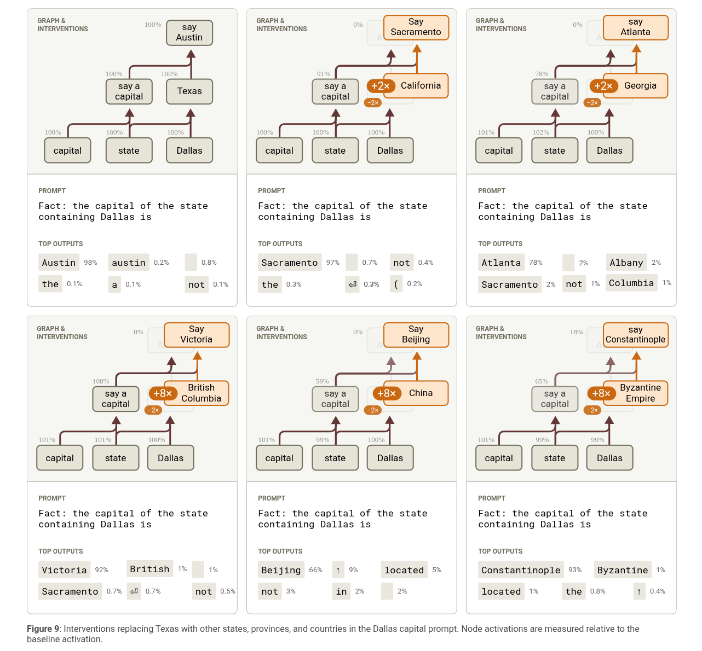
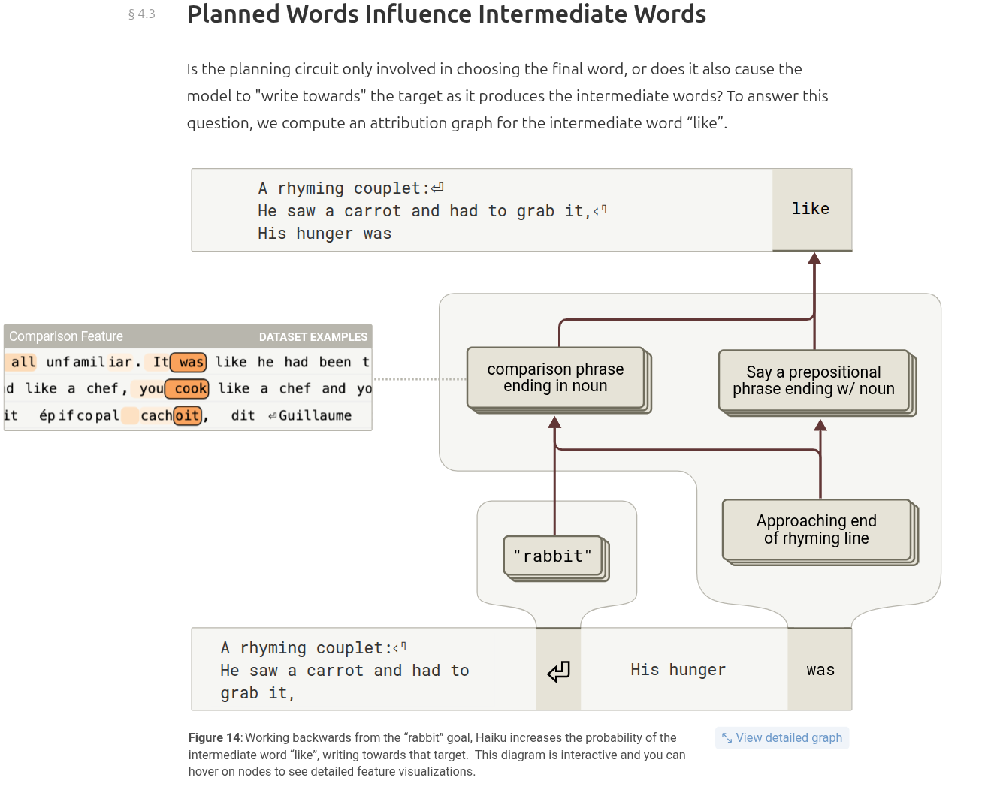
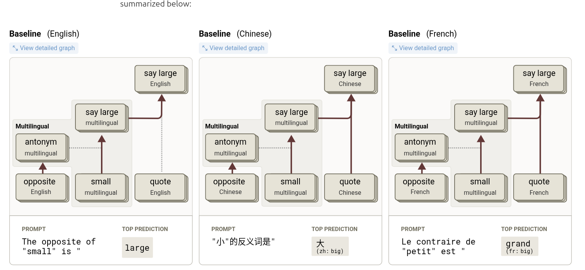
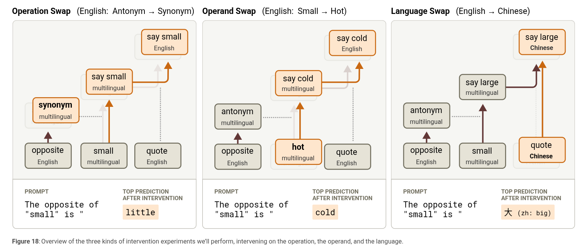
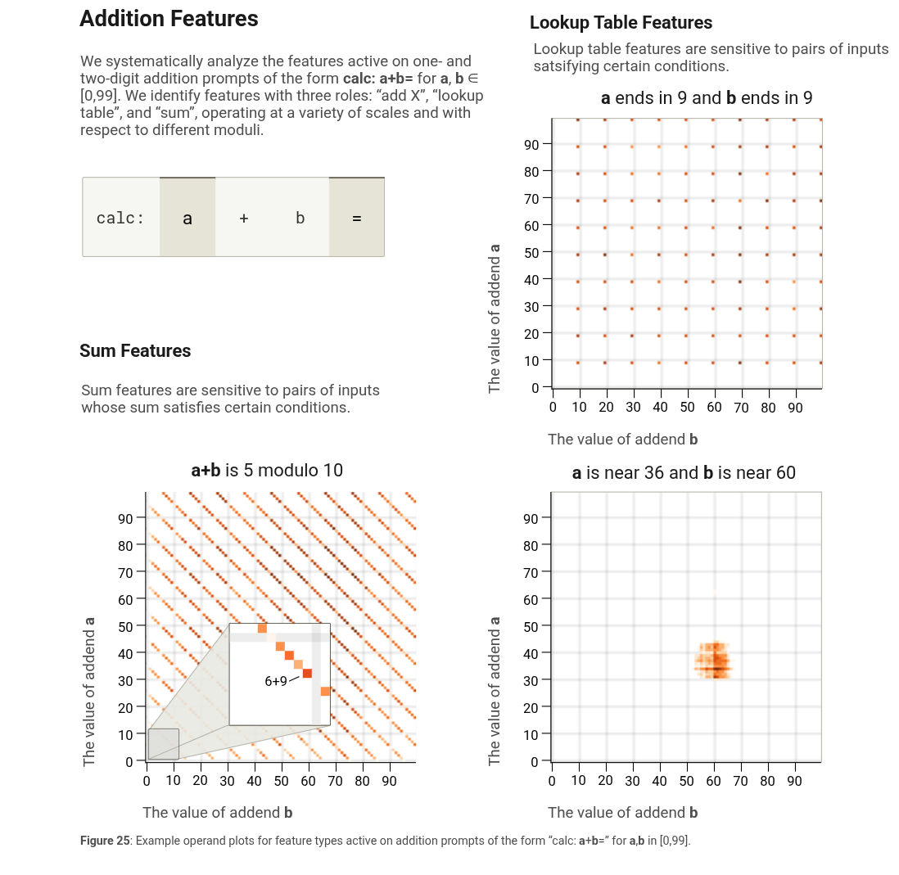
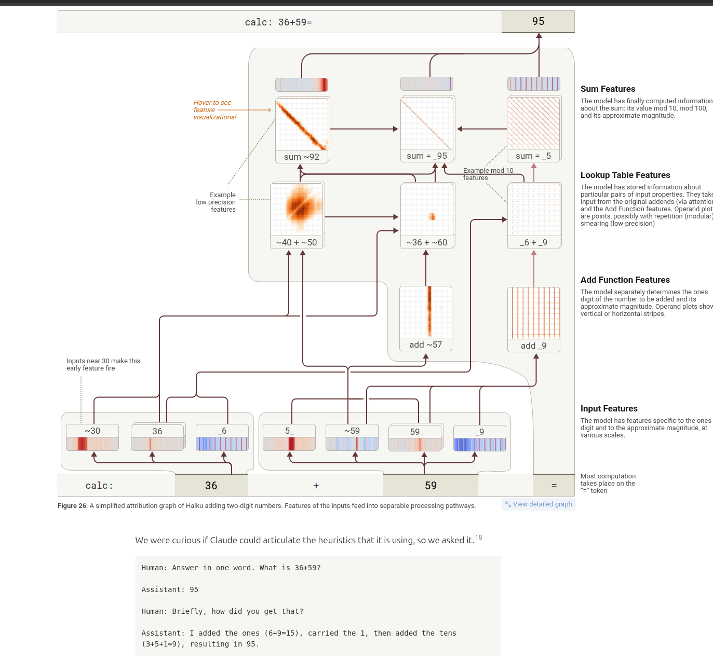
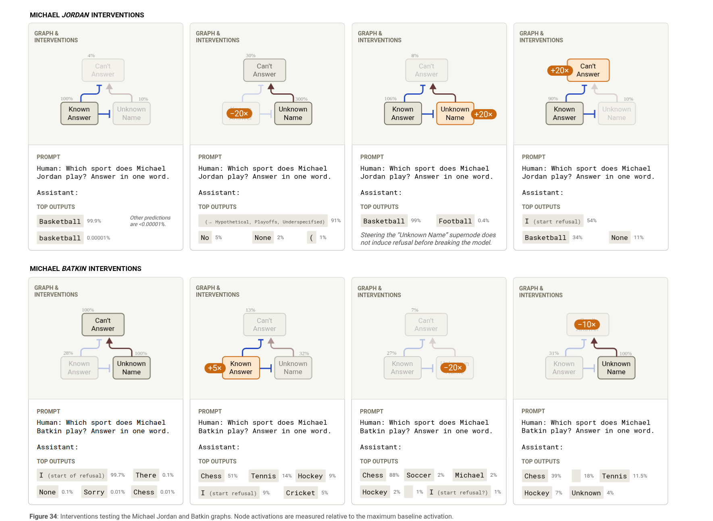

# notes for transcoder paper research
will implement on a small model later in torchrvn repo interpretability folder

## on the biology of llm paper notes
https://transformer-circuits.pub/2025/attribution-graphs/biology.html

## cross layer transcoder

each CLT reads residue stream before MLP with an encoder and writes to MLP_out of all future MLPs using seperate decoders.  
all CLTs outputs are added and trained as a unified system.  
each CLT is supposed to capture what that MLP adds to the residue stream, and since later MLP layers could just amplify the same feature, it should include amplifications. So the same feature is only appear once in the graph.  

encoding:  

$$a_ℓ = JumpReLU(W_{enc}^ℓ · h_ℓ)$$  

- $a_ℓ$: feature activations at layer $ℓ$, shape $[n_{features\_per\_layer}]$
- $W_{enc}^ℓ$: encoder matrix at layer $ℓ$, shape $[n_{features\_per\_layer}, d_{model}]$
- $h_ℓ$: residual stream post-attention at layer $ℓ$, shape $[d_{model}]$

decoding:  
$$\hat{y}_ℓ = \sum_{ℓ'=1}^{ℓ} W_{dec}^{ℓ' \to ℓ} \cdot a_{ℓ'}$$

- $\hat{y}_ℓ$: CLT reconstruction of MLP output at layer $ℓ$, shape $[d_{model}]$
- $W_{dec}^{ℓ' \to ℓ}$: decoder matrix for features at layer $ℓ'$ writing to layer $ℓ$, shape $[d_{model}, n_{features\_per\_layer}]$
- $a_{ℓ'}$: feature activations from layer $ℓ'$, shape $[n_{features\_per\_layer}]$
- sum runs over all layers from $1$ to $ℓ$ (all earlier features contribute)

## specific findings

different features activation across levels form reasoning chains. you can test the effect of each by turning it up (times a positive number) or turning it down (times a negative number)
the relationship between features can be if chainging the previous feature affects future features
similar features can be grouped together as feature cluster for cleaner graphs

#### future plans affect intermediate word

we can see the model plans to say 'rabbit' on a feature of the end of line token so the model says 'like' to prepare for a rabbit analogy

#### multipligual circuits

different languages share the same features. with an additional language feature determining output language.

the features can be tested by switching operands, operations, of languages

#### addition

rather than having a clean computerized / formal addition logic, models seems to rely on many circuits. including last digit circuits, rough estimate circuits, and special modulo result detection circuits. however when asked to self reflect the model says it did the formal logic.

#### halucinations

due to post training, models have a default answer of i don't know in obscure questions. when seeing a known entity it inhibits the i dont know feature.
