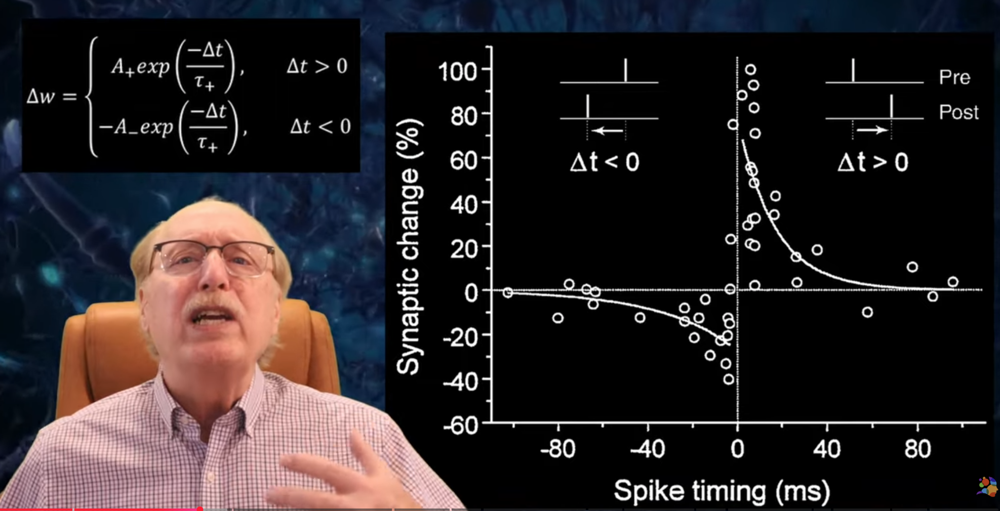
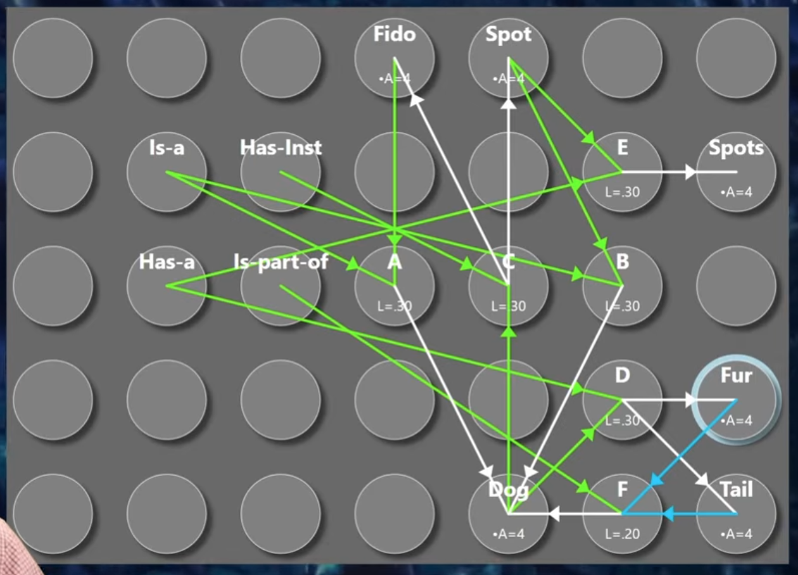
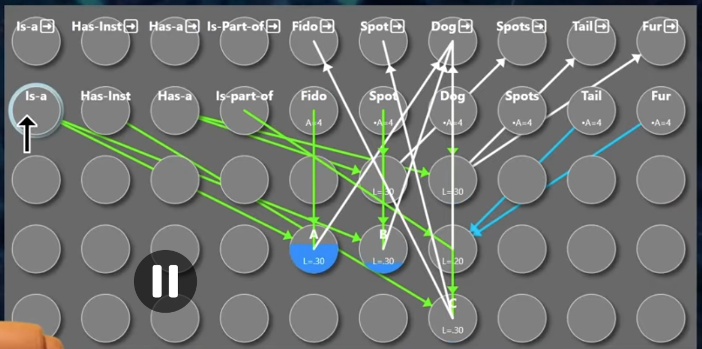
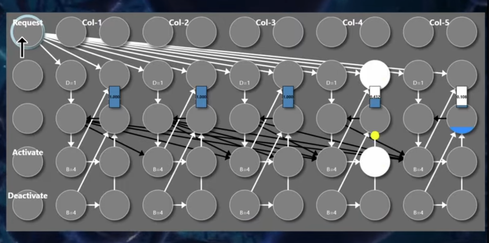
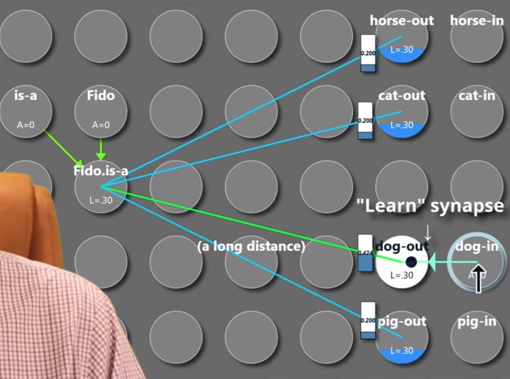

# notes for the youtube channel https://www.youtube.com/@FutureAISociety  

kind of too schizo and too neuron level symbolic but still an interesting theory
a channel about neuroscience simulations  
kind of an alternative view but still very interesting  

# some of my own thoughts:  

maybe individual neurons mentioned here are population coded tensors and the directioned weights are like dot product results? to be more realistic?

# notes for the playlist "How Your Brain Works"  

https://www.youtube.com/watch?v=ebuOPux0o68&list=PLyVWtpGV9fFKDkX4Posupz7mijgvPkTEz&index=3

transistors are much faster than neurons and the brain is much more parallel  

STDP is like if A fires then B immediately fires, B's receiver of A strengthens. further time apart, less strengthening. if B fires before A, strength decreases.  

weights cannot be set precisely. the more precise, the slower. synapse weight is impossible for brain to read back.  
biological synapse weight do not exceed 0.15 cause a synapse can only grow so many neurotransmitter receivers. but two neurons can have multiple synapses connecting them so in simulation the number can go higher like 1. .  
synapse should exist in exitatory inhibitory pairs since they have different chemistry the brain cannot just glide across the values.  
synapses tend towards either maximum or minimum value or a few values in between cause if A can lead to B firing the synapse value will rapidly approach maximum.  

https://www.youtube.com/watch?v=cQLBXt3rQb8&list=PLyVWtpGV9fFKDkX4Posupz7mijgvPkTEz&index=4

a neuron with a leakage rate that requires two inputs neurons to be firing to fire can be used as an AND gate.  
example: Fido is a dog.  
Fido and "is a" trigger an AND neuron which triggers dog.  
also there is "has instance", "is part of", "has a" relationships. can use some attributes such as having a tail, to reverse search dog (with a opposite direction connection) then search for dogs 

https://www.youtube.com/watch?v=T8cQKvLjVnM&list=PLyVWtpGV9fFKDkX4Posupz7mijgvPkTEz&index=5

the same concept can have two neurons representing them one for input one for output.  

relationship detector neuron. i.e. input: fido, dog output. output: is-a output.  

attribute inheritance (i.e. Fido inherits dog attributes). Fido only needs to store exceptions attributes from a generic dogs.  

i.e. trigger at the same time (is-a, has-a), also trigger Fido. Fido + is-a trigger dog-output. dog-output + has-a trigger tail.  

recursion neuron: transforms an output concept into a input concept (same concept)  
this neuron: opposite of recursion. transforms a input concept into a output concept  

https://www.youtube.com/watch?v=wVeGYkPM2Sw&list=PLyVWtpGV9fFKDkX4Posupz7mijgvPkTEz&index=6

brain made up of 3 parts. brain stem: keep me alive. cerebellum: motor action. neo cortex: conscious thought.  

neo cortex is made up of gray matter on top (neurons) and white matter on bottom (axons that connect them). neo cortex is divided into similarly structured corticol columns.  

neo cortex is divided into layers like an output layer and input layer

neo cortex already comes with unused AND neurons and meaning is learnt from strenghtening the synapse from is-a to dog and 

https://www.youtube.com/watch?v=dj6EWCUHivA&list=PLyVWtpGV9fFKDkX4Posupz7mijgvPkTEz&index=7

cortical columns can have a "in use" synapse that can be checked parallely to see which one is free to use. they laterally inhib each other so only one fires. there's also activate and deactivate neurons that can directly change it's "in use" weights. 

https://www.youtube.com/watch?v=1Ip8xg8LPkA&list=PLyVWtpGV9fFKDkX4Posupz7mijgvPkTEz&index=8

neurons learn by parallely querying fido and is-a into a collective query neuron that triggers many latter concept-out at once. but when that concept like dog, dog-in fires too, dog-in might have a "learning synapse" to dog-out, perhaps modulated with some neuromodulator conditions. so when fido-is-a and dog-in both fires, the connection between fido-is-a and dog-out is strengthened.  

